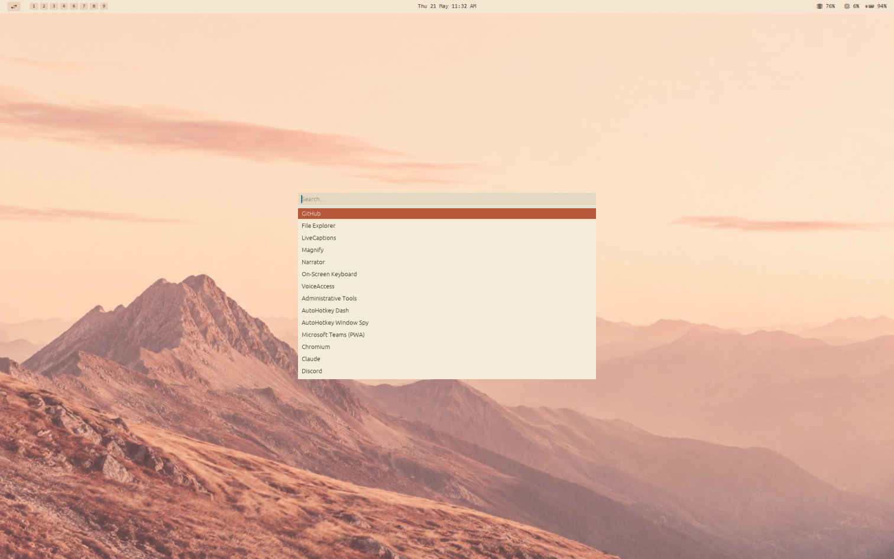

# wmenu



Keyboard-driven Windows utility. A dmenu-style app launcher, a system-action menu (Omakase), an idle-defeating cursor wiggler (Amphetamine), and user-defined global hotkey bindings — all in one tray-resident binary.

## Features

- **Launcher** — global hotkey (default `Alt+Space`) opens a centred popup that fuzzy-matches Start Menu shortcuts. `↑/↓`, `Enter`, `Esc`.
- **Omakase menu** — second global hotkey (default `Alt+Super+Space`) opens a keyboard-driven menu for system actions (shutdown / restart / hibernate), the **ecosystem Theme picker** (see below), and toggles.
- **Theme orchestrator** — picking a theme from the Omakase Theme submenu fans the choice out to wmenu, [wbar](https://github.com/YannickHerrero/wbar), [Explorer](https://github.com/YannickHerrero/Explorer), GlazeWM border colours, WezTerm, the Windows dark/light + DWM accent registry, and the desktop wallpaper — all in one keystroke. Each leg fails independently.
- **Amphetamine** — optional background worker nudges the cursor every 4 minutes to keep the screensaver away.
- **Hotkey bindings** — arbitrary user-defined global hotkeys mapped to one of four action types: `Launch` (run a command), `Url` (open in default browser), `Script` (PowerShell / cmd / pwsh), or `FocusOrLaunch` (focus an existing window or spawn the exe if not running).
- **Settings window** — a real resizable window with a sidebar: General (theme, autostart, start-minimized), Launcher (built-in hotkeys, scan interval, extra dirs), Bindings (the user-defined ones), Amphetamine, About. External edits to `config.toml` hot-reload via a file watcher.

## Build

Requires the Rust toolchain (1.85+ for edition 2024).

```
cargo build --release
```

On non-Windows hosts, cross-compile against the Windows target:

```
rustup target add x86_64-pc-windows-gnu
cargo build --release --target x86_64-pc-windows-gnu
```

The build needs `mingw-w64` (Debian/Ubuntu: `sudo apt install mingw-w64`).

## Use

Run `wmenu.exe`. A tray icon appears.

- Press `Alt+Space` to open the launcher, type to filter, `↑/↓` to navigate, `Enter` to launch, `Esc` to dismiss. The popup also dismisses on focus loss.
- Press `Alt+Super+Space` to open the Omakase system-action menu. Keyboard-driven nested navigation.
- Right-click the tray icon → `Settings` (or press `Ctrl+,` inside the launcher) to open the settings window.

## Control from the terminal

wmenu listens on `127.0.0.1:17129`. The same `wmenu.exe` binary works as a CLI client when invoked with a subcommand — the second invocation talks to the running daemon over IPC instead of trying to start a second instance.

```powershell
wmenu set-theme Stone    # switch theme live (Paper|Stone|Sage|Clay|Ink)
wmenu --help             # show usage
```

The new theme is applied immediately *and* persisted to `config.toml`, so it survives a restart.

### Ecosystem theme switch (Omakase → Theme)

Picking a theme from the Omakase **Theme** submenu (`Alt+Super+Space → Theme → <Name>`) drives a single orchestration pass that flips every visual surface in the user's setup at once. Each leg is best-effort — a failure (e.g. wbar not running, no wallpaper file present) is logged and skipped, the rest still apply.

| Target | Mechanism |
|---|---|
| wmenu itself | local apply + persist (same code path as `wmenu set-theme`) |
| wbar | TCP `127.0.0.1:17128` `set-theme <Name>\n` |
| Explorer | overwrites the `theme` field in `%APPDATA%\com.ilios.explorer\config.json`; Explorer's backend file watcher picks it up and pushes the new CSS variables to the running window |
| GlazeWM | rewrites the focused / unfocused border `color:` lines marked with `# wmenu-theme-focused` / `# wmenu-theme-unfocused` sentinel comments in `~/.glzr/glazewm/config.yaml`, then spawns `glazewm command wm-reload-config` |
| WezTerm | writes a full `config.colors` table to `~/.wezterm-colors.lua`; WezTerm hot-reloads any file added to its `add_to_config_reload_watch_list`. By default, ANSI slots use the theme's full terminal palette; enable `terminal_monochrome` to keep ANSI colors within the active theme's hue. |
| Windows | `HKCU\…\Personalize\AppsUseLightTheme` / `SystemUsesLightTheme` (Ink → 0, others → 1) + `HKCU\…\DWM\AccentColor` / `ColorizationColor` (ABGR), then `SendMessageTimeoutW(HWND_BROADCAST, WM_SETTINGCHANGE, "ImmersiveColorSet")` so running apps repaint without log-out |
| Wallpaper | `SystemParametersInfoW SPI_SETDESKWALLPAPER` on `%APPDATA%\wmenu\wallpapers\<theme>.png` |

The orchestrator logs a single-line report per switch — `theme orchestrator: wbar=ok explorer=ok glazewm=ok windows=ok wezterm=ok wallpaper=ok` — visible in `%APPDATA%\wmenu\config\logs\wmenu.log.<date>`.

### Direct CLI

For scripts and keybinds, the legacy single-tool form still works (only flips wmenu's own theme; doesn't fan out):

```powershell
wmenu set-theme Stone
```

## Settings

Sidebar pages:

- **General** — theme (Paper / Stone / Sage / Clay / Ink), monochromatic terminal colours, launch with Windows, start minimised to tray.
- **Launcher** — launcher hotkey, omakase hotkey, scan interval, extra Start Menu directories to index.
- **Bindings** — user-defined hotkeys. Each row has a label, a key combo (e.g. `Alt+Enter`, `Ctrl+Alt+G`), and an action (Launch / Open URL / Run script / Focus or launch).
- **Amphetamine** — toggle the cursor wiggler.
- **About** — version, config-file path.

`Save` persists to `config.toml` and re-applies. Editing the file externally also triggers an immediate reload.

## State

- Config: `%APPDATA%\wmenu\config\config.toml`
- MRU history: `%APPDATA%\wmenu\config\mru.json`
- Logs: `%APPDATA%\wmenu\config\logs\wmenu.log.<date>` (daily rolling)

Set `WMENU_LOG=debug` to widen the log filter.

## Indexing

On start the daemon scans the per-user and system Start Menu directories for `.lnk` shortcuts. The index refreshes when the launcher fires if the last scan is older than `scan_interval_minutes` (default 5). Shortcuts are passed to `ShellExecuteW` as-is, so target arguments (e.g. Firefox web apps) and UWP activations work the same way they do from Start Menu.
